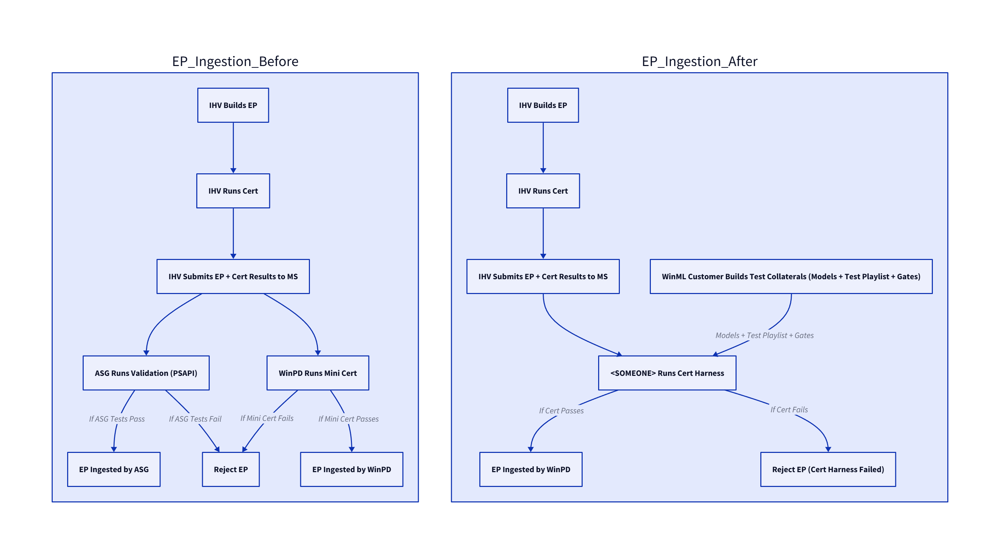

# Replat Documentation

## Table of Contents
1. [Overview](#overview)
2. [Objective and Goals](#objective-and-goals)
3. [Replat Architecture](#replat-architecture)
4. [Expected Customer UX](#expected-customer-ux)
5. [Validation](#validation)
6. [FAQ](#faq)

---

 

# Overview

Replat is the replatforming initiative for 1P and 0P ONNX Runtime (ORT) clients, transitioning them from the legacy model—where each client individually ingests and packages its own execution provider (EP)—to a unified architecture powered by Windows Machine Learning (WinML). Functionally, Replat replaces the underlying execution stack with minimal to no impact on feature behavior or key performance indicators (KPIs) such as accuracy and latency.

This migration encompasses AI Fabric and ORT clients including OneOCR, PSAPI, Live Translations, Studio Effects, and Face Detect. Upon completion, each client will invoke WinML to execute models, delegating EP download, management, and invocation to the WinML runtime. As a result, clients are no longer responsible for integrating or maintaining EPs within their application packages. Importantly, Replat does not introduce new features, as it operates strictly at the infrastructure level.

Replat marks a fundamental shift in how EPs are distributed and consumed within the Windows ecosystem. Historically, ORT clients bundled EPs within their applications, leading to increased package sizes and deployment complexity. With WinML integration, EP provisioning becomes a system-level capability delivered via the Windows App SDK through the Microsoft Store. WinML intelligently detects the device's hardware configuration and dynamically provisions the appropriate EPs using Unified Update Platform (UUP) packages to optimize performance.

This architectural evolution enables applications to request execution resources—such as local NPU acceleration—on demand via the WinML interface. The result is reduced application complexity, streamlined deployment, and improved hardware utilization across a wide range of Windows devices.

 

# Expected Customer UX

Replatforming occurs are the model execution layer, which sits beneath the application layers. Thereforce, features and applications should not have any impact with replat efforts. Features will continue to function without disruption and with model KPI's such as accuracy and latency preserved. While unlikely, there may be small changes in system fundamentals (memory and power) due to minor changes in IHV execution providers as part of the WinML architecture. By in large, features should run at the same level of quality and health as they did with the old stack, or better.

 

# Objectives

- Replatform OneOCR and PSAPI by end of 2025 with no customer impact.
- Fast-follow replatform of additional ORT clients (Live Translations, Studio Effects, Face Detect).
- Ensure new/upcoming ASG features are built on WinML from the start.
- Centralize EP management via WinML to reduce complexity.
- Validate parity in accuracy and latency between old and new stacks.
- Enable seamless stack replacement for both in-market and new devices.  

# High Level Architecture Diagram

The diagram below shows both the stacks of AI Fabric. The older stack invokes a PSAPI that carries with it models and IHV execution providers. The replat variant of AI Fabric invokes WinML, which will be found on the local device. WinML will detect the device platform and NPU type and request for the right EP UUP package from Windows Update. Once the EP is deployed, the execution stack is complete and WinML will schedule work on the NPU per the application's (in this case, PSAPI) request.

 
 

# Validation

## EP Ingestion and Gating

)

### **Current Situation (as of August 2025)**

Independent Hardware Vendors (IHVs) are now required to run their execution providers (EPs) through **AITK Certification** prior to any release and submit the resulting test data to Microsoft. However, the certification scope currently excludes 0P/1P CoPilot+ (CP+) models and only includes a limited set of open-source (OSS) models that represent the current P0 supported list for WinML.

Due to the existing application stack design, each ORT client—such as **PSAPI** or **Live Translations**—must package and validate its own EP. This places the responsibility for EP validation and ingestion squarely on the client teams. Developers are free to define their own test plans and validation collateral, including how they assess the risk of regressions introduced by new EP versions.

One of the core goals of WinML is to centralize EP download and management. Post-replat, WinML will assume responsibility for EP ingestion, including rerunning AITK Certification as part of a "trust, but verify" approach. However, since AITK Cert does not natively include 0P/1P CP+ models—and ORT clients will no longer ingest EPs directly—this raises a critical question: **Who owns the validation of incoming EPs against regressions for CP+ models?**

Specifically, there is ambiguity around:
- **Ownership of test plan creation**
- **Execution of validation workflows**
- **Decision-making authority for gating EP ingestions when failures are detected**

Clarifying these responsibilities is essential to ensure the integrity and performance of CP+ models under the new WinML-driven architecture.

### Proposal

As outlined in the current situation, Replat shifts EP ingestion from individual ORT clients to WinML. While this centralization simplifies deployment, it introduces ambiguity around validation ownership—especially for CP+ models not covered by AITK Cert.

---

#### **Validation Plan Components R&R**

| **Entity**         | **Responsibilities**                                                                 | **Notes**                                                                 |
|--------------------|--------------------------------------------------------------------------------------|---------------------------------------------------------------------------|
| **WinML Team**     | - Owns EP ingestion pipeline - Executes AITK Cert - Integrates CP+ test suite | Acts as the central gatekeeper for EP ingestion and validation workflows |
| **CP+ Model Owners** | - Define model-specific test cases - Provides Models to test with - Provide expected test behaviors and expected outputs - Triage failures | Maintain domain expertise and ensure model integrity                     |
| **AITK Team**      | - Expand Cert coverage to include CP+ models - Maintain test infrastructure       | Supports validation tooling and certification standards                  |

---

#### **Execution Workflow**
- EP update triggers AITK Cert and CP+ model validation suite.
- Failures are logged and routed to model owners.
- Ingestion is gated until regressions are resolved or waived.

---

#### **Governance & Reporting**
- Monthly review board (WinML, CP+ owners, AITK) evaluates outcomes and updates coverage.
- Central dashboard tracks validation history, coverage, and waivers.

---

#### **Open Questions**
- Who maintains the device lab and ensures we have up to date hardware?
  *Note: Vicente has meetings with WSSI to discuss leveraging WSSI IDC Lab*
- What's the SLA for triage and resolution to make final verdict on go/no go for ingestion and resolving issues?

---

Here’s a revised **App Compat** section that reflects the early-stage engagement with Ramesh, Sundar, and Lindsay’s teams, incorporates Sundar’s feature testing role, and clearly outlines the phased validation approach for Replat:

---

## App Compat

We are in the early stages of engaging with the App Compat team to validate Replat’s impact on existing 1P applications. Initial conversations with Ramesh, Lindsay, and Sundar have been productive, and the team has expressed willingness to support our validation efforts as Replat progresses through its engineering phases.

Sundar currently leads feature-level validation for onboarding scenarios and has been identified by the WinPD team as the go-to for early testing. His work focuses on validating new functionality in dev and beta branches, providing a baseline for functional correctness. Ramesh and Lindsay have confirmed that Sundar can support Replat validation in this capacity, especially during Phase 1, where we expect to sideload EPs and validate basic stack integrity.

The broader App Compat team, led by Sneha with guidance from Ramesh and Lindsay, will engage more deeply in Phase 2 and beyond. Their focus will be on end-to-end compatibility testing across hardware configurations, ensuring that 1P apps continue to function as expected with the new WinML-based EP ingestion model. This includes regression validation, fallback scenario coverage, and edge case handling.

We are working with the team to define a phased validation plan:

- **Phase 1 (Pre-GA)**: Feature-level validation by Sundar using sideloaded EPs. Goal is to catch early regressions and validate stack wiring.
- **Phase 2 (Post-GA readiness)**: Broader App Compat engagement with store-delivered EPs. Focus on full-stack validation across supported NPUs.
- **Phase 3 (Self-host)**: Full automation and RI gate integration for ongoing compatibility assurance.

This collaboration will help ensure that Replat remains invisible to end users while enabling a more scalable and maintainable EP delivery model via WinML.

---

## FAQ

### Disabling CPU Execution: Transitioning from Dual Builds to Runtime Control

As part of the AI Fabric and WinML replat effort, the team is shifting away from the legacy dual-build strategy for disabling CPU execution. Historically, CPU code paths were stripped at build time using flags like `enable CPU`, resulting in separate builds that either included or excluded CPU execution support. While effective, this approach introduced complexity and rigidity into the build pipeline.

The proposed change embraces a more flexible and maintainable model by enforcing CPU execution restrictions at runtime. This involves:

- **Runtime Configuration**: CPU EP access is now governed by session-level flags and policy settings, rather than build-time exclusions. This allows for dynamic control over which execution providers are enabled.
- **Production Safeguards**: In production, only the EP matching the device's package (e.g., NPU) is included. CPU EPs are excluded from these packages, preventing fallback scenarios. AI Fabric will implement additional hardening to ensure only the intended EP is active.
- **Session Protections**: Developers can disable fallback explicitly using session options like `disable_cpu_fallback`, which is supported by providers such as OpenVINO. AMD EPs do not support fallback, while Vitis allows limited fallback for specific operators but includes configuration to restrict this behavior.
- **Testing Flexibility**: The relaxed restrictions enable easier CI and local testing using CPU, without compromising production integrity. This is especially useful for development workflows and regression testing.

This shift aims for a broader effort to streamline deployment, reduce build complexity, and support dynamic configuration across heterogeneous hardware environments. It also aligns with the team's goal of minimizing platform-specific code and standardizing EP packaging and registration via MSIX and NuGet.

### Side-By-Side Builds in Play B and Play C Packages

Play B relies on WinML being included in the OS image via CBS (Component-Based Servicing). This means WinML is already present and serviced as part of the OS, avoiding any dependency on external delivery mechanisms like the Store. The AI Fabric in Play B simply calls into the OS-provided WinML if the Velocity key is enabled. This approach ensures tight servicing alignment and avoids duplication.

Play C, on the other hand, includes WinML-compatible code directly inside the AI Fabric package. This is because Play C is modular and delivered independently of the OS. Including WinML in the package allows Play C to function even if the OS doesn't have the right WinML version. However, whether WinML is actually used depends on a Velocity key. If validation fails, the system falls back to using Execution Providers (EPs) instead of invoking WinML.

This design gives Play C flexibility during internal testing while Play B prioritizes servicing stability and OS integration.

 

---
